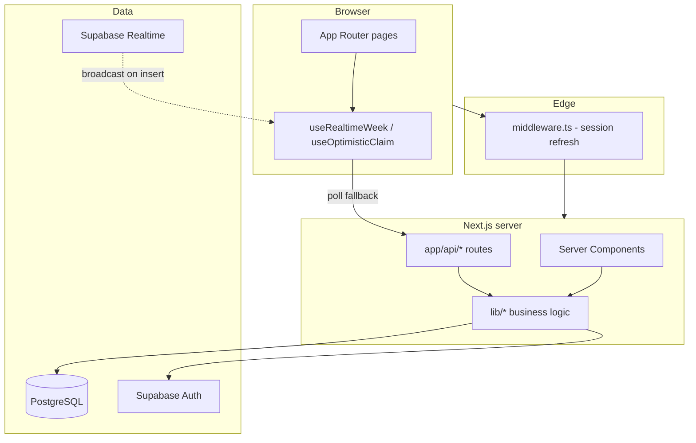
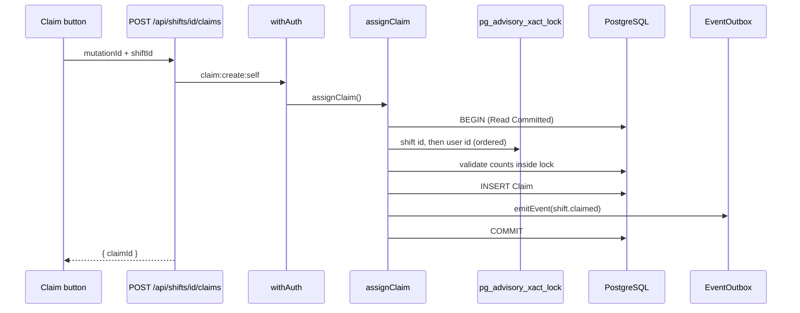
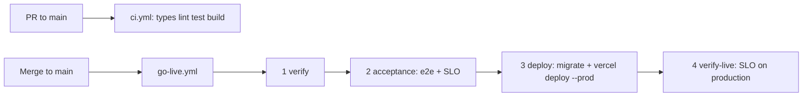

# MedRoster — Codebase Guide

A one-stop reference for understanding how MedRoster is built: what each layer does, how data flows, why the import pipeline looks the way it does, and where to start reading code.

**Companion docs:** [`DECISIONS.md`](../DECISIONS.md) (why we chose X), [`REQUIREMENTS.md`](REQUIREMENTS.md) (what the app must do), [`SLO.md`](SLO.md) (production budgets), [`KNOWN_ISSUES.md`](KNOWN_ISSUES.md) (operational caveats).

---

## Interactive exploration (Understand Anything)

This repo is wired for the **Understand Anything** plugin — an interactive knowledge graph and guided tour over the codebase.

### Setup (already done)

| File | Purpose |
|------|---------|
| `.understand-anything/config.json` | Plugin settings (`autoUpdate`, language) |
| `.understand-anything/.understandignore` | Files excluded from graph analysis (review and uncomment patterns as needed) |

### Generate the graph

In **Cursor**, run:

```
/understand
```

First run scans the project (~200+ source files), builds nodes/edges for functions, routes, schema, imports, layers, and a guided tour. Subsequent runs are incremental when only some files changed.

Useful flags:

| Flag | Effect |
|------|--------|
| `/understand --full` | Force full rebuild |
| `/understand --auto-update` | Refresh graph on each commit |
| `/understand --review` | Run LLM graph reviewer for quality check |

### Open the dashboard

After `/understand` completes:

```
/understand-dashboard
```

This launches a local Vite app where you can:

- Browse **architectural layers** (API, lib, UI, prisma, etc.)
- Follow the **guided tour** step-by-step
- Click nodes to see summaries, imports, and relationships
- Ask questions via `/understand-chat` (if enabled in your install)

### How this doc and the graph relate

| Use this guide when… | Use Understand Anything when… |
|----------------------|----------------------------------|
| You want narrative context and design rationale | You want to click through dependencies visually |
| You're onboarding to import/auth/concurrency | You're hunting "who calls X?" or "what imports Y?" |
| You need the full API/schema reference tables | You want the auto-generated tour and layer map |

---

## What MedRoster is

A **shift scheduler for a small clinic**. Managers post the rota; staff claim shifts. The server enforces business rules so a shift is never double-booked or quietly left short-staffed.

The clinic's legacy spreadsheet (`staff.csv`, `shifts.csv`) is imported on first boot; every cleaning decision is auditable in the UI.

### Stack at a glance

| Layer | Choice | Why |
|-------|--------|-----|
| App | Next.js 16 (App Router), React 19 | One deployable; server components for data-heavy screens |
| DB | PostgreSQL + Prisma 7 | Advisory locks, transactional guarantees for claims |
| Auth | Supabase Auth (email + password) | httpOnly session cookie; role from `User` row, not JWT |
| Validation | Zod (`lib/contracts/`) | One schema per endpoint; shared client + server |
| UI | Tailwind v4 + shadcn/ui | CSS-first tokens |
| Realtime | Supabase Realtime (optional) | WebSocket broadcast; falls back to 4s polling |
| Deploy | Vercel (serverless) + Supabase | Go-live gate in CI; local dev uses `next dev` |
| Tests | Vitest + Testcontainers, Playwright | Real Postgres for concurrency; real Chrome for flows |

---

## Architecture overview



### Request lifecycle (authenticated page)

1. **`middleware.ts`** — Refreshes Supabase session cookies (Edge runtime; no Prisma). Redirects to `/login` if no session.
2. **`app/(app)/layout.tsx`** — Resolves `currentSessionUser()` from DB; redirects if missing or deactivated.
3. **Page (RSC)** — Fetches data via Prisma or internal API patterns.
4. **Mutations** — Client calls `app/api/*`; `withAuth` checks permissions; `lib/rules/*` runs in a transaction.
5. **Events** — `emitEvent()` writes to `EventOutbox` in the same transaction; trigger broadcasts (if Supabase realtime exists).
6. **Client refresh** — `WeekRealtimeSync` receives events → `router.refresh()` unless it's the client's own optimistic `mutationId`.

### Request lifecycle (mutation / claim)



---

## Project structure

```
MedRoster/
├── app/                    # Next.js App Router
│   ├── (marketing)/        # Public landing
│   ├── (app)/              # Authenticated shell (dashboard, shifts, import, members…)
│   ├── auth/               # OAuth callback, confirm, invite, password flows
│   ├── api/                # REST API (see API reference below)
│   └── login/              # Sign-in + demo accounts
├── components/             # UI (week grid, shift controls, import report, realtime sync)
├── hooks/                  # use-realtime.ts, use-optimistic-claim.ts
├── lib/                    # Core business logic (see lib/ map below)
├── prisma/                 # schema.prisma, migrations, seed, prune
├── supabase/               # Local stack config + email templates
├── tests/                  # Vitest (~80 files, Testcontainers Postgres)
├── e2e/                    # Playwright browser specs
├── scripts/                # slo-check.ts, supabase-prod-config.ts
├── docs/                   # Requirements, SLO, this guide
├── staff.csv, shifts.csv   # Seed/import source data
├── middleware.ts           # Edge auth
├── DECISIONS.md            # Architecture decision log
└── vercel.json             # Region, cron, disabled auto-deploy on main
```

### Route groups

| Group | Path prefix | Guard |
|-------|-------------|-------|
| Marketing | `/` | Public |
| Auth pages | `/login`, `/forgot-password`, `/auth/*` | Mixed |
| App | `/dashboard`, `/shifts`, `/my-shifts`, `/import`, `/members`, `/account` | Middleware + layout session check |

---

## Database schema

Source: `prisma/schema.prisma`

### Entity relationship (simplified)

```
User ──────< Claim >────── Shift ──────< ShiftRequirement
  │              │           │
  │              │           └──> ShiftSeries (optional)
  ├──< ImportRun ──< ImportRowResult
  └──< DropNotice

EventOutbox          (append-only, no FKs)
MutationOutcome      (idempotency, mutationId PK)
OutboxWatermark      (singleton id=1, pruning cursor)
```

### Enums

| Enum | Values | Used for |
|------|--------|----------|
| `Role` | `MANAGER`, `STAFF` | Permission matrix |
| `Profession` | `DOCTOR`, `NURSE`, `RECEPTIONIST` | Shift requirements, claim eligibility |
| `ImportSource` | `SEED`, `UPLOAD` | Audit: boot import vs manager upload |
| `FileKind` | `STAFF`, `SHIFT` | Which CSV pipeline ran |
| `RowOutcome` | `ACCEPTED`, `REPAIRED`, `MERGED`, `REJECTED` | Per-row import result |

### Model highlights

| Model | Critical fields | Notes |
|-------|-----------------|-------|
| **User** | `authUserId`, `deactivatedAt`, `externalId` | `authUserId` null = imported but never invited. Role/profession always from DB, never JWT. |
| **Shift** | `version`, `seriesId`, `externalId` | `version` for optimistic edit locking. Claims do **not** bump version. |
| **ShiftRequirement** | `profession`, `requiredCount` | Unique per `(shiftId, profession)` |
| **Claim** | `assignedById` | null = self-claim; set when manager assigns |
| **ShiftSeries** | `weekdays`, `requirements` (JSON) | Recurring shift template |
| **ImportRun** / **ImportRowResult** | `issues` (JSON), `rawRow` | Full audit trail per spreadsheet line |
| **MutationOutcome** | `scope`, `result` | Client `mutationId` replay; scope mismatch = error |
| **DropNotice** | `shiftStartsAt` snapshot | Survives shift deletion and outbox pruning |
| **EventOutbox** | `topic`, `type`, `payload` | `topic` = `week:{isoWeek}`; pruned after 10 days |
| **OutboxWatermark** | `prunedUpTo` | Lets clients detect cursor fell off the log |

### Migrations worth knowing

| Migration area | Why it matters |
|----------------|----------------|
| Advisory lock functions | `withOrderedLocks` in `lib/rules/locks.ts` |
| Realtime broadcast trigger | `AFTER INSERT ON EventOutbox` → `realtime.send()` (skipped without `realtime` schema) |
| DropNotice, OutboxWatermark | Durable notices + safe outbox pruning |

---

## `lib/` module map

```
lib/
├── auth/           session, permissions, withAuth/withPublic/withCronAuth, roster-gate
├── config/         env.ts (boot validation), database-url.ts (APP_ENV → DB)
├── contracts/      Zod schemas: shifts, claims, week, events, members, imports
├── db/             Prisma client (lazy proxy), cursor pagination
├── domain/         errors, time (ISO weeks, overlaps), profession labels
├── events/         outbox emit, week topics
├── rules/          assign, unassign, edit, validate, locks, idempotency, retention
├── import/         CSV pipeline (parse → reconcile → apply)
├── members/        invite, deactivate, reactivate, status
├── seed/           run-seed, auth-accounts, claim-seeder
├── supabase/       server/browser/admin clients
├── dashboard/      week analytics, nearest-week resolution
└── theme/          preference parsing, server theme resolution
```

### Dependency rules (informal)

- **`lib/rules/assign.ts`** is the **only** code path that creates `Claim` rows.
- **`lib/contracts/`** is imported by API routes and client forms — never duplicate validation.
- **`lib/auth/session.ts`** maps Supabase user → Prisma `User` → `Principal`; wrapped in React `cache()`.
- **`lib/db/client.ts`** resolves DB URL via `APP_ENV`; lazy-init so route-import tests don't need a database.

---

## API reference

All routes live under `app/api/`. Authenticated routes use `withAuth(permission, handler)` from `lib/auth/with-auth.ts`. Route guard brands are tested in `tests/rbac/routes.test.ts`.

| Route | Methods | Permission | Handler purpose |
|-------|---------|------------|-----------------|
| `/api/health` | GET | public | `SELECT 1` + commit SHA (load balancer probe) |
| `/api/cron/prune` | GET, POST | `CRON_SECRET` bearer | Retention: mutation outcomes, drop notices, outbox |
| `/api/events/since` | GET | `shift:read` | Poll outbox since cursor; detects truncation via watermark |
| `/api/weeks/[isoWeek]` | GET | `shift:read` | Dictionary-encoded week payload + ETag |
| `/api/shifts` | GET, POST | `shift:read`, `shift:create` | List/create shifts or series |
| `/api/shifts/[id]` | GET, PATCH, DELETE | `shift:read`, `shift:update`, `shift:delete` | Detail, edit (dry-run + confirm), delete |
| `/api/shifts/[id]/claims` | POST | `claim:create:*` | `assignClaim` |
| `/api/shifts/[id]/claims/[userId]` | DELETE | `claim:delete:*` | `unassignClaim` |
| `/api/staff` | GET | `staff:read` | Directory (id, name, profession only — no emails) |
| `/api/members` | GET, POST | `member:read`, `member:invite` | List + invite |
| `/api/members/[id]` | DELETE | `member:manage` | Deactivate |
| `/api/members/[id]/invite` | POST, DELETE | `member:invite`, `member:manage` | Resend/revoke invite |
| `/api/members/[id]/reactivate` | POST | `member:manage` | Clear deactivation (does not restore claims) |
| `/api/imports` | GET, POST | `import:read`, `import:run` | History + CSV upload |
| `/api/imports/[runId]` | GET | `import:read` | Full row-level report |
| `/api/notices/[id]` | DELETE | `shift:read` | Dismiss own drop notice |
| `/api/me/theme` | PATCH | `shift:read` | Persist theme to DB + cookie |

### Permission matrix

| Permission | MANAGER | STAFF |
|------------|---------|-------|
| `shift:read/create/update/delete` | ✓ | read only |
| `claim:create/delete:self` | ✓ | ✓ |
| `claim:create/delete:any` | ✓ | — |
| `staff:read` | ✓ | ✓ (names for assignment UI) |
| `member:*`, `import:*` | ✓ | — |

`scopedPermission()` resolves `:self` vs `:any` for claim endpoints based on target user id.

---

## Pages reference

| Page | File | Who | What |
|------|------|-----|------|
| Landing | `app/(marketing)/page.tsx` | Public | Marketing |
| Login | `app/login/page.tsx` | Public | Email/password + demo fill buttons |
| Dashboard | `app/(app)/dashboard/page.tsx` | All | Week grid, coverage charts, realtime |
| Shift detail | `app/(app)/shifts/[id]/page.tsx` | All | Claims, timeline, manager edit/assign |
| New shift | `app/(app)/shifts/new/page.tsx` | Manager | Create shift or series |
| My shifts | `app/(app)/my-shifts/page.tsx` | Staff | Claimed shifts + drop notices |
| Members | `app/(app)/members/page.tsx` | Manager | Invite, deactivate, reactivate |
| Import | `app/(app)/import/page.tsx` | Manager | Upload CSV |
| Import report | `app/(app)/import/[runId]/page.tsx` | Manager | Per-row outcomes + legend |
| Account | `app/(app)/account/page.tsx` | All | Password, theme |
| Auth callback | `app/auth/callback/route.ts` | — | OAuth code exchange + roster gate |
| Auth confirm | `app/auth/confirm/route.ts` | — | TokenHash exchange (local/custom SMTP) |
| Hash bridge | `app/auth/hash-session-bridge.tsx` | — | Fragment tokens (prod default emails) |

---

## Auth

### Three layers of "invite only"

1. **Supabase `disable_signup`** — no self-service accounts (`npm run supabase:config`)
2. **Magic link** — `shouldCreateUser: false` in code
3. **Roster gate** — `/auth/callback` and `/auth/confirm` check Prisma profile; stray OAuth users deleted

### Session resolution (`lib/auth/session.ts`)

1. `supabase.auth.getUser()` — revalidates token, not just cookie decode
2. Lookup `User` by `authUserId`
3. Reject if missing or `deactivatedAt` set
4. Return `Principal` from **database row**, not token metadata

### Middleware vs layout

| Check | `middleware.ts` | `app/(app)/layout.tsx` |
|-------|-----------------|------------------------|
| Has Supabase session | ✓ | ✓ (defense in depth) |
| User in roster DB | — | ✓ |
| Deactivated | — | ✓ |
| Can use Prisma | ✗ (Edge) | ✓ |

### Production email quirk

Default Supabase emails put tokens in the URL **fragment** (`#access_token=...`). Fragments never reach the server, so `hash-session-bridge.tsx` handles them client-side. With custom SMTP + `{{ .TokenHash }}` templates, `/auth/confirm` handles links server-side again. See `DECISIONS.md` § "Emailed sign-in links ride the URL fragment".

---

## Import module — deep dive

**Why it exists:** The clinic's rota lived in messy CSVs. Managers need to see *exactly* what happened to every row — not a silent "import succeeded."

**Why it's built this way:** Separating **parse** (per-cell rules), **reconcile** (cross-row duplicates), and **apply** (DB + audit) keeps each concern testable and makes the import report honest.

### Pipeline

```
CSV text
  │
  ├─ splitCsv()                    lib/import/csv.ts
  │
  ├─ parseStaffRows / parseShiftRows   per-cell FieldRules
  │     └─ issues[] per row (REPAIR or FATAL)
  │
  ├─ reconcileStaff / reconcileShifts  cross-row merge/dedup
  │     └─ DUPLICATE_*, EMAIL_COLLISION, etc.
  │
  └─ applyStaffImport / applyShiftImport
        └─ ImportRun + ImportRowResult (every line, including accepted)
```

Entry points: `lib/import/index.ts`

```ts
runStaffImport(text)  → reconcileStaff(parseStaffRows(text))
runShiftImport(text)  → reconcileShifts(parseShiftRows(text))
```

### Field rules (`lib/import/registry.ts`)

- **`createFieldRule`** — declares `emits: RuleDescriptor[]` at construction; a rule cannot emit undeclared codes.
- **`collectLegend` / `mergeLegends`** — build manager-facing legend; **throws** if two rules disagree on the same code's meaning.
- **No global mutable registry** — rules are plain values; import order cannot change behavior.

Each cell rule returns a coerced value or `null` (fatal). Repairs push `Issue` with `before → after`.

### Staff rules (`lib/import/staff.ts`)

- Id, name, email, profession (with alias normalization: `RN` → `NURSE`, etc.)
- **Blank email is fatal** — email is login identity
- **Names are never re-cased** — `ALI`, `O'Neill` preserved; roles are normalized (closed enum)

### Shift rules (`lib/import/shifts.ts`)

- Id, date, start time, end time, requirements (`doctor=2;nurse=1` form)
- **Date formats decoded from evidence** (see `DECISIONS.md`):
  - Slash: `dd/mm/yyyy` (first field reaches 30)
  - Dash: `mm-dd-yyyy` (second field reaches 27)
  - Ambiguous dates → rejected, not guessed
- **Requirements:** refuses free-text (`"two nurses and a doctor"` → fatal)
- **Overnight:** `resolveShiftWindow` shared with shift API — importer and API cannot disagree
- **Duration cap:** 12 hours max after rollover repair

### Reconciliation (`lib/import/reconcile.ts`)

Processes rows sorted by **lowest external id wins**.

| Key type | Staff | Shifts |
|----------|-------|--------|
| Identity keys | `id:{externalId}`, `email:{email}` | `id:{externalId}`, `slot:{iso times + requirements}` |

| Collision | Outcome |
|-----------|---------|
| Same id, identical row | `DUPLICATE_ROW` → merge |
| Same id, different data | `DUPLICATE_ID_CONFLICT` → keep first |
| Same email + same name | `DUPLICATE_PERSON` → merge to lower id |
| Same email + different name | `EMAIL_COLLISION` → **reject** |
| Same slot + requirements | `DUPLICATE_SHIFT` → merge to lower id |

**Critical design choice:** Shift merge key includes **requirements**, not just date/time. Without it, ~40 real shifts would have been silently destroyed (same slot, different headcounts). See `DECISIONS.md`.

### Apply (`lib/import/apply.ts`)

- Upserts `User` or `Shift` + `ShiftRequirement` by `externalId`
- Writes `ImportRun` with stats + one `ImportRowResult` per source line
- Used by **seed** (`lib/seed/run-seed.ts`) and **upload API** (`app/api/imports/route.ts`)

### Legend (`lib/import/legend.ts`)

`IMPORT_LEGEND` merges all rule sources. A test asserts **every code the importer can emit is documented** — undocumented codes fail the build.

### Idempotency of seed vs upload

- **Seed import** (`SEED`): skipped if already run (docker compose re-boot safe)
- **Manager upload** (`UPLOAD`): always creates a new `ImportRun` (audit history)

---

## Rules engine & concurrency

### `assignClaim` — single entry point

`lib/rules/assign.ts` is the **only** function that creates `Claim` rows. Staff claims, manager assignments, and the seeder all go through it.

### Validation (`lib/rules/validate.ts`)

Pure checks inside the lock:

- Shift not in the past
- User has required profession
- Role not full (`ROLE_FULL`)
- No overlapping shifts (`OVERLAP`)

### Advisory locks (`lib/rules/locks.ts`)

```ts
withOrderedLocks(tx, { shiftIds, userIds }, fn)
```

- Namespaces: `SHIFT=1`, `USER=2`
- Order: all shift ids ascending, then all user ids ascending
- **Must use `ReadCommitted`** — `RepeatableRead` snapshots before lock grant → measured oversell (12 winners on 3-nurse shift). Regression test pins isolation level.

### Transaction options

| Setting | Value | Why |
|---------|-------|-----|
| `isolationLevel` | `ReadCommitted` | Correctness with advisory locks |
| `maxWait` | 15s | Burst claims queue behind one shift lock |
| `timeout` | 20s | Bounds pathological stalls |
| Pool `max` | 20 (env override) | Serverless × instances; blocked tx holds connection |

### Idempotency (`lib/rules/idempotency.ts`)

- Client sends `mutationId` (16-char hex)
- `MutationOutcome` stores `{ mutationId, scope, result }` in same transaction
- Scope: `claim:{shiftId}:{userId}:{actorId|self}`
- Replay returns stored result; scope mismatch → error (not silent wrong answer)

### Shift edits (`lib/rules/edit.ts`)

- `PATCH ?dryRun=1` re-validates claims against proposed state
- Confirm carries `version` **and** `claimsToken` (claim set fingerprint)
- Ineligible claimants dropped oldest-first; `DropNotice` + `shift.claims_dropped` event

---

## Realtime & events

### Outbox (`lib/events/outbox.ts`)

Mutations call `emitEvent(tx, { topic, type, payload, mutationId })` **inside the same transaction**.

| Event type | When |
|------------|------|
| `shift.created` | New shift |
| `shift.edited` | Shift updated |
| `shift.deleted` | Shift removed |
| `shift.claimed` | Claim added |
| `shift.unclaimed` | Claim released |
| `shift.claims_dropped` | Edit removed claimants |

Topics: `week:{isoWeek}` — subscribers only wake for the week they're viewing.

### Transport

| Environment | Mechanism |
|-------------|-----------|
| Supabase with `realtime` schema | DB trigger → WebSocket broadcast |
| Local Postgres / tests | Poll `GET /api/events/since` every 4s |

**Why not SSE on Vercel?** Would hold a serverless function open per viewer and hit duration caps. See `DECISIONS.md` § "SSE became WebSocket".

### Client (`hooks/use-realtime.ts` + `components/realtime/week-realtime-sync.tsx`)

- On subscribe/reconnect: `catchUp()` replays from last event id
- `shouldApply(event, ownMutationIds)` — skip own optimistic echoes
- `cursorLost` / `truncated` → full resync (`router.refresh()`)
- Dedup key: `(topic, mutationId)` — edits crossing week boundaries broadcast to both topics

### Retention (`lib/rules/retention.ts`)

| Store | TTL | Pruned by |
|-------|-----|-----------|
| `MutationOutcome` | 24h | cron / `npm run db:prune` |
| `DropNotice` | grace + 30d | cron |
| `EventOutbox` | 10d | cron (updates `OutboxWatermark`) |

---

## Members & invites

| Action | What happens |
|--------|--------------|
| **Invite** | Creates Supabase user, emails link; invitee sets password |
| **Deactivate** | Bans Supabase user, sets `deactivatedAt`, deletes **future** claims |
| **Reactivate** | Lifts ban, clears `deactivatedAt`; **does not** restore released claims |

Locally, emails land in Mailpit (`http://127.0.0.1:54324`). Production needs custom SMTP for real delivery.

---

## Contracts (Zod)

`lib/contracts/` — single source of truth for API request/response shapes.

| Module | Covers |
|--------|--------|
| `shifts.ts` | Create, edit, list, detail |
| `claims.ts` | Claim/release bodies |
| `week.ts` | Dictionary-encoded week payload codec |
| `events.ts` | Outbox event shapes |
| `members.ts` | Invite, member list |
| `imports.ts` | Upload metadata |
| `common.ts` | Pagination, shared primitives |

Client forms and API routes import the same schemas — the button you can't press and the endpoint that would 403 should never disagree.

---

## Week payload encoding

`GET /api/weeks/[isoWeek]` uses dictionary encoding (`refs` + positional tuples) — ~55% smaller on realistic data. Encoder/decoder in `lib/contracts/week.ts`, round-trip tested. **Applied to exactly one endpoint**; everything else stays plain JSON for debuggability. See `DECISIONS.md`.

---

## Testing

### Vitest (`npm test`)

- **Testcontainers** — real Postgres per test file; `fileParallelism: false`
- **Helpers** — `tests/helpers/db.ts` resets DB between tests

| Directory | Focus |
|-----------|-------|
| `tests/import/` | Parser, reconcile, golden files, legend completeness |
| `tests/concurrency/` | Claim bursts, isolation level, deactivate races |
| `tests/rules/` | assign, edit, validate, idempotency, retention |
| `tests/api/` | Route handlers |
| `tests/rbac/` | Permission matrix, route guard brands |
| `tests/auth/` | Session, roster gate, callbacks |

### Playwright (`npm run test:e2e`)

Requires running server (`npm run build && npm start`). Uses installed Chrome; `BASE_URL` configurable.

Key specs: `auth`, `claiming`, `import`, `manager`, `members`, `realtime`, `hash-session` (fragment tokens — must be real browser).

### SLO (`npm run slo`)

`scripts/slo-check.ts` — health, latency, error rate, deploy integrity. Two profiles: `local` vs `production` budgets. See `docs/SLO.md`.

---

## Configuration

| Variable | Scope | Purpose |
|----------|-------|---------|
| `APP_ENV` | server | `development` \| `production` → picks DB URL (**not** `NODE_ENV`) |
| `DATABASE_URL` | server | Overrides `APP_ENV` selection |
| `DATABASE_URL_DEV` / `_PROD` | server | Per-environment Postgres |
| `DATABASE_POOL_MAX` | server | Prisma pool size (default 20) |
| `NEXT_PUBLIC_SUPABASE_*` | client | Required for all Supabase clients |
| `SUPABASE_SERVICE_ROLE_KEY` | server | Admin: invites, ban, delete stray users |
| `APP_URL` | server | Auth redirect origins |
| `CLINIC_TZ` | server | Wall-clock timezone (default `Europe/London`) |
| `CRON_SECRET` | server | Bearer for `/api/cron/prune` |
| `SEED_PASSWORD` | server | Demo account password |

Boot: `getServerEnv()` / `getClientEnv()` throw loudly on missing required vars.

---

## Deployment



- **Vercel Git integration disabled** on `main` — only the gate deploys
- **Region:** `hnd1` (Tokyo) — must match Supabase region for SLO latency
- **Cron:** daily 03:00 UTC → `/api/cron/prune`
- **Local:** `next dev` + Supabase CLI; **prod:** serverless functions on Vercel

---

## Suggested reading order

### Day 1 — Orientation

1. `README.md` — setup and demo accounts
2. `DECISIONS.md` — the "why" behind non-obvious choices
3. `prisma/schema.prisma` — data model
4. `middleware.ts` + `app/(app)/layout.tsx` — auth gates

### Day 2 — Core flows

5. `lib/rules/assign.ts` + `lib/rules/validate.ts` — claiming
6. `app/api/shifts/[id]/claims/route.ts` — API surface
7. `components/shift/claim-button.tsx` + `hooks/use-optimistic-claim.ts` — UI
8. `app/(app)/dashboard/page.tsx` + `components/week-grid/` — manager view

### Day 3 — Import

9. `lib/import/index.ts` — pipeline entry
10. `lib/import/shifts.ts` — date/requirement rules
11. `lib/import/reconcile.ts` — merge logic
12. `app/(app)/import/[runId]/page.tsx` — report UI
13. `tests/import/golden.test.ts` — expected outcomes on dirty CSVs

### Day 4 — Realtime & ops

14. `lib/events/outbox.ts` + `hooks/use-realtime.ts`
15. `lib/rules/edit.ts` — shift edits with claim drops
16. `.github/workflows/go-live.yml` + `docs/SLO.md`

### Interactive

17. Run `/understand` then `/understand-dashboard` for the graph tour

---

## Quick file index

| Topic | Start here |
|-------|------------|
| Schema | `prisma/schema.prisma` |
| Business rules | `lib/rules/assign.ts`, `edit.ts`, `validate.ts` |
| Auth | `middleware.ts`, `lib/auth/session.ts`, `app/auth/callback/route.ts` |
| Import | `lib/import/index.ts`, `reconcile.ts`, `legend.ts` |
| Realtime | `hooks/use-realtime.ts`, `lib/events/outbox.ts` |
| Permissions | `lib/auth/permissions.ts`, `tests/rbac/routes.test.ts` |
| Requirements | `docs/REQUIREMENTS.md` |
| Decisions | `DECISIONS.md` |
| Known issues | `docs/KNOWN_ISSUES.md` |

---

*Last updated: generated with the codebase at project root. Re-run `/understand` after large refactors to refresh the knowledge graph.*
